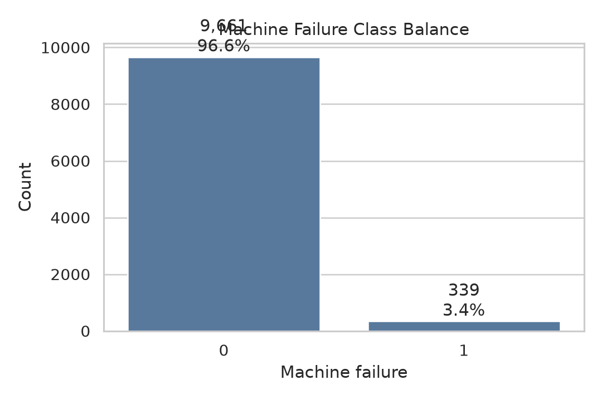
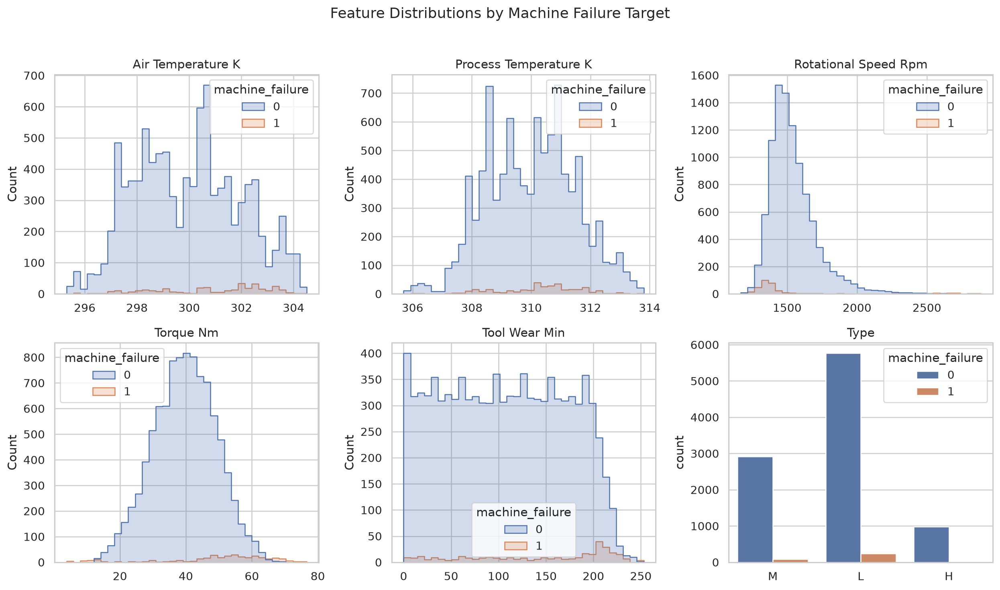
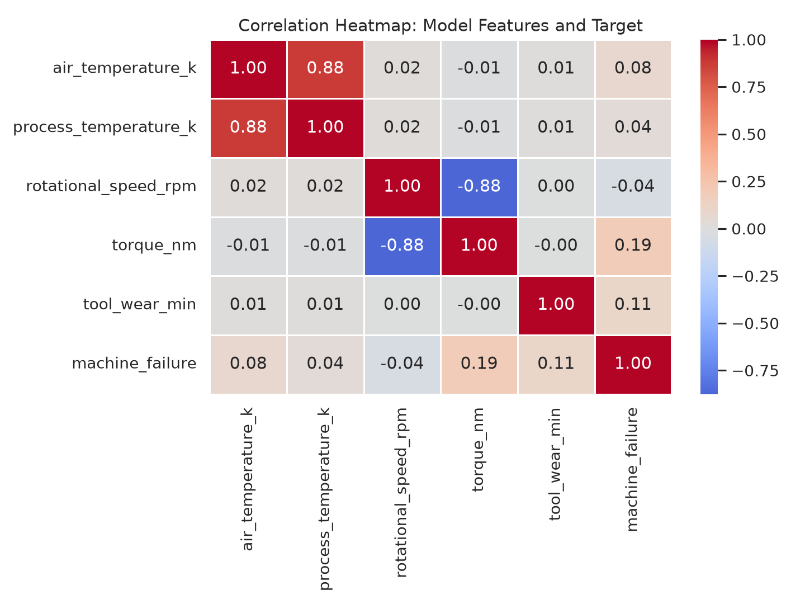
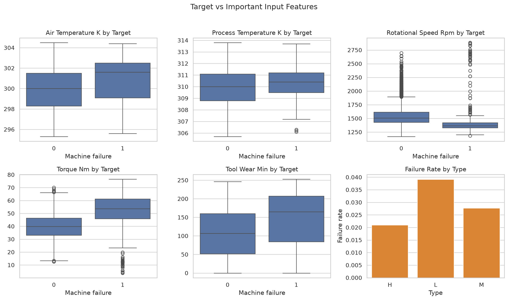
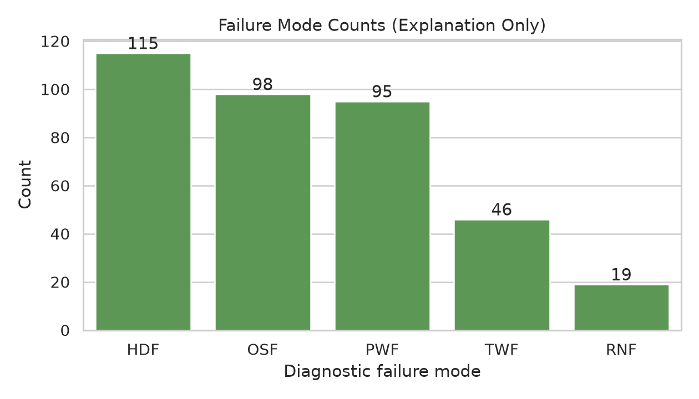
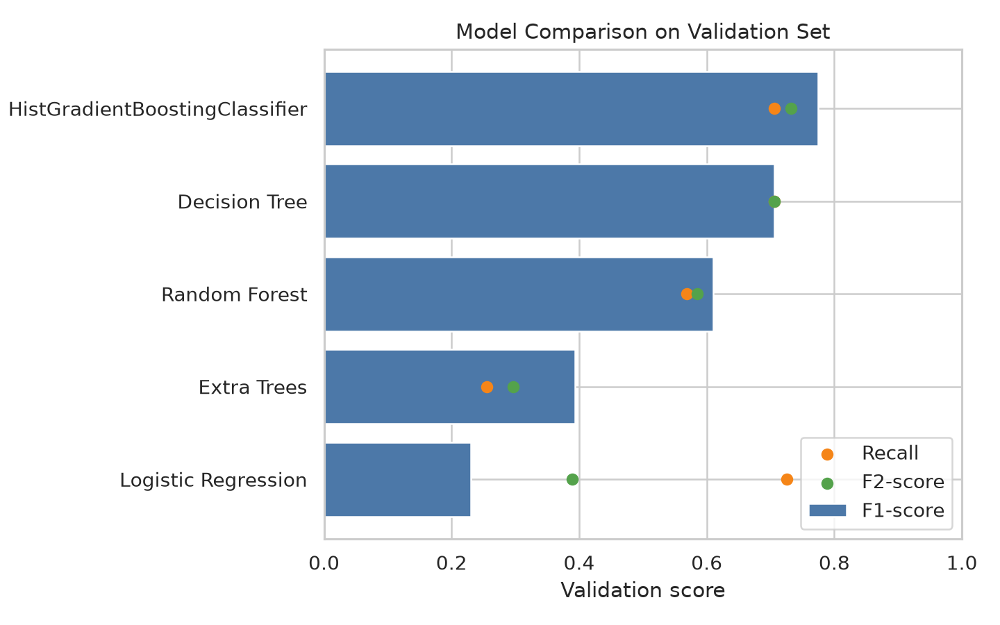
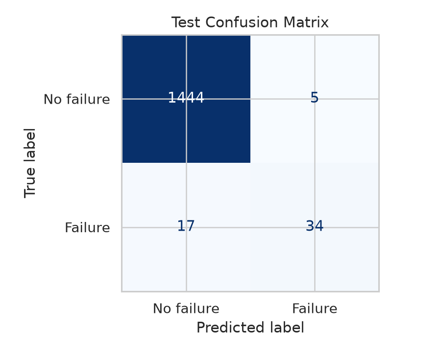
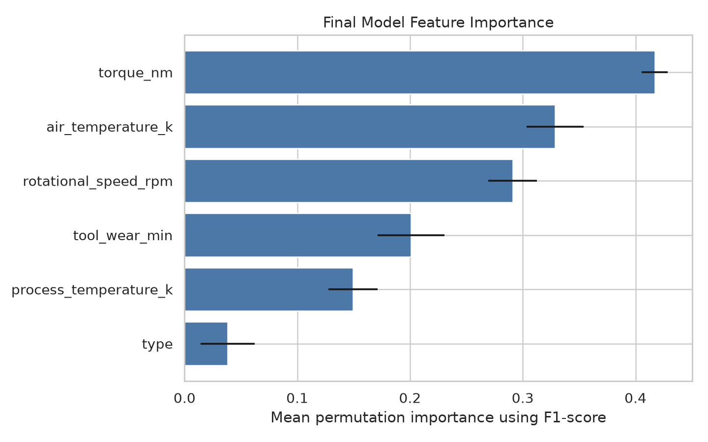

# Machine Failure Prediction Using the AI4I 2020 Predictive Maintenance Dataset

**Course:** COEN 330 - Applied Machine Learning
**Institution:** Concordia University
**Project type:** Supervised binary classification for predictive maintenance
**Team members:** Niraj Patel, Samuel Lavallée, Thinoushan Senathirajah, Omar Shrit, Arnav Singh

## 1. Abstract
This project builds a supervised binary classifier for machine failure prediction using the AI4I 2020 Predictive Maintenance Dataset from the UCI Machine Learning Repository. The model uses product type and five numeric operating measurements as inputs. Diagnostic failure-mode columns are excluded from model training because they leak target information. Five classifiers were compared using a stratified 70/15/15 train/validation/test split. The selected model was HistGradientBoostingClassifier, chosen by validation F1-score. On the held-out test set, it reached accuracy 0.9853, precision 0.8718, recall 0.6667, F1-score 0.7556, F2-score 0.6996, and ROC-AUC 0.9750. The report emphasizes recall, F1-score, F2-score, ROC-AUC, and the confusion matrix because failures are rare and accuracy alone can hide missed failures.

## 2. Introduction and Motivation
Predictive maintenance uses machine data to estimate whether equipment is likely to fail. In real settings, a missed failure can cause downtime, repair costs, safety issues, and production delays. Fixed maintenance schedules can also be inefficient because machines may be inspected too early or too late. A machine learning model can help by using operating conditions to flag failure risk before a breakdown becomes more serious.

This project treats machine failure prediction as a binary classification problem. The goal is not only to obtain a high score, but to build a reproducible applied machine learning workflow: prepare the data, prevent leakage, compare multiple models, tune selected models on validation data, evaluate once on a held-out test set, interpret the errors, and provide a local demo.

The AI4I dataset was selected because it is directly related to machine condition monitoring, has a clear binary failure label, and is small enough for a course project where every step can be rerun. It is still limited because it is synthetic, so the results should be treated as a course-project demonstration rather than a production maintenance system.

## 3. Related Work or Background
Predictive maintenance problems can be framed as classification, regression, anomaly detection, or survival analysis depending on the data available. This project uses supervised classification because the AI4I dataset includes a ready-made binary target indicating whether a machine failure occurred.

Tabular predictive maintenance data is often modeled using both simple and nonlinear algorithms. Logistic Regression provides a useful baseline, while tree-based models and gradient boosting can capture nonlinear interactions between variables such as torque, rotational speed, temperature, and tool wear. Comparing several models helps avoid relying on a single algorithm without evidence.

## 4. Dataset Description
The dataset used in this project is the AI4I 2020 Predictive Maintenance Dataset from the UCI Machine Learning Repository. The local raw file is data/raw/ai4i2020.csv. It contains 10,000 synthetic observations. Each row represents a machine operating condition, and the target variable is machine_failure.

The dataset is distributed through UCI under the CC BY 4.0 license and is credited to Stephan Matzka. It is associated with the paper "Explainable Artificial Intelligence for Predictive Maintenance Applications" (2020).

### Table 1. Dataset summary
| Item | Description |
| --- | --- |
| Dataset name | AI4I 2020 Predictive Maintenance Dataset |
| Source | UCI Machine Learning Repository |
| Local raw file | data/raw/ai4i2020.csv |
| Number of observations | 10,000 |
| Main task | Binary classification |
| Target variable | machine_failure |
| Positive class | Machine failure |
| Data type | Tabular data |
| License | CC BY 4.0 |
| Dataset limitation | Synthetic dataset, not direct real factory data |

### Table 2. Target variable
| Target value | Meaning |
| --- | --- |
| 0 | No machine failure |
| 1 | Machine failure |

### Table 3. Model input features
| Feature | Type | Description |
| --- | --- | --- |
| type | Categorical | Product quality/type category |
| air_temperature_k | Numerical | Air temperature in kelvin |
| process_temperature_k | Numerical | Process temperature in kelvin |
| rotational_speed_rpm | Numerical | Rotational speed in revolutions per minute |
| torque_nm | Numerical | Torque in newton-metres |
| tool_wear_min | Numerical | Tool wear time in minutes |

### Table 4. Columns removed or excluded
| Column group | Columns | Reason |
| --- | --- | --- |
| ID columns | UDI, Product ID | Identifiers, not predictive operating measurements |
| Diagnostic failure-mode columns | TWF, HDF, PWF, OSF, RNF | Leakage risk because they describe specific failure modes related to the target |

The diagnostic failure-mode columns are useful for explanation and EDA, but they are not used as input features. Including them would give the model information too close to the answer and would make the reported performance unrealistic.

## 5. Preprocessing and Exploratory Data Analysis
Preprocessing loads the raw CSV, cleans column names into Python-friendly snake_case, drops ID columns, keeps the binary target, and writes data/processed/ai4i_processed.csv. The processed file keeps diagnostic failure-mode columns for explanation only, not for modeling.

The missing-values summary shows zero missing values in all processed columns, so no imputation step was required. Feature engineering is intentionally simple: one-hot encoding for the categorical type feature and numerical standardization inside the modeling pipeline.

The generated plot files were fixed at the source in the plotting code so that report figures do not have clipped text, crowded labels, or cut-off legends.

### Table 5. Missing-value summary
| Column | Missing count | Missing percent |
| --- | --- | --- |
| type | 0 | 0.0 |
| air_temperature_k | 0 | 0.0 |
| process_temperature_k | 0 | 0.0 |
| rotational_speed_rpm | 0 | 0.0 |
| torque_nm | 0 | 0.0 |
| tool_wear_min | 0 | 0.0 |
| machine_failure | 0 | 0.0 |
| twf | 0 | 0.0 |
| hdf | 0 | 0.0 |
| pwf | 0 | 0.0 |
| osf | 0 | 0.0 |
| rnf | 0 | 0.0 |

### Figure 1. Class balance

Figure 1 shows the distribution of the target variable. The failure class is much smaller than the no-failure class, which makes this an imbalanced classification problem and explains why accuracy alone is not enough.

### Figure 2. Feature distributions

Figure 2 shows the distributions of the main operating features. No rows were removed as outliers because unusual operating points may be meaningful for failure prediction.

### Figure 3. Correlation heatmap

Figure 3 shows the correlation relationships among numerical variables. Correlation is useful for understanding feature relationships, but it does not automatically determine which variables should be removed.

### Figure 4. Target versus feature relationships

Figure 4 compares feature distributions across the target classes and shows where failure and non-failure samples overlap.

### Figure 5. Failure mode counts

Figure 5 summarizes diagnostic failure-mode columns for explanation only. These columns are excluded from model training to prevent leakage.

## 6. Methodology and Models
The project trains exactly five supervised classification models. The purpose is to compare different model assumptions and levels of complexity, from a linear baseline to stronger tree-based ensembles.

### Table 6. Models used in the project
| Model | Role in the project | Notes |
| --- | --- | --- |
| Logistic Regression | Simple baseline | Linear model with class_weight="balanced" |
| Decision Tree | Interpretable nonlinear model | Tuned using validation data |
| Random Forest | Ensemble tree model | Tuned using validation data |
| Extra Trees | Additional ensemble benchmark | Fixed settings, not grid-tuned |
| HistGradientBoostingClassifier | Boosting model and final selected model | Tuned using validation data |

Logistic Regression was used as a baseline because it is simple and interpretable. Decision Tree, Random Forest, Extra Trees, and HistGradientBoostingClassifier were included to capture nonlinear relationships. Class weighting was used where available to reduce the effect of class imbalance.

## 7. Validation and Hyperparameter Tuning Strategy
The dataset is split into training, validation, and test sets using stratification and random_state=42. The validation set is used for tuning and model selection. The test set is reserved for final evaluation only.

### Table 7. Dataset split strategy
| Split | Percentage | Purpose |
| --- | --- | --- |
| Training set | 70% | Fit model parameters |
| Validation set | 15% | Tune hyperparameters and select the final model |
| Test set | 15% | Final held-out evaluation only |

### Table 8. Hyperparameter tuning summary
| Model | Tuned hyperparameters | Validation trials |
| --- | --- | --- |
| Logistic Regression | Fixed baseline settings | 1 |
| Decision Tree | criterion, max_depth, min_samples_leaf | 18 |
| Random Forest | n_estimators, max_depth, min_samples_leaf | 8 |
| Extra Trees | Fixed ensemble settings | 1 |
| HistGradientBoostingClassifier | learning_rate, max_iter, max_leaf_nodes | 8 |

All candidate hyperparameter combinations are evaluated on the validation set. The full 36-trial history is saved in results/hyperparameter_trials.csv, while the report summarizes only the best validation result per model to keep the comparison readable. The final selected model object is saved as models/final_model.joblib; candidate model objects from individual trials are not saved.

## 8. Experimental Setup
The project is organized as a reproducible command-line workflow. The authoritative scripts are listed below.

### Table 9. Main project commands
| Command | Purpose |
| --- | --- |
| python -m src.preprocessing | Load and preprocess the raw dataset |
| python -m src.eda | Generate exploratory outputs and plots |
| python -m src.train | Train, tune, compare models, and save the final model |
| python -m src.evaluate | Evaluate the final model on the held-out test set |
| python demo/demo.py | Run a local prediction demonstration |

### Table 10. Main result and report files
| Output file | Description |
| --- | --- |
| data/processed/ai4i_processed.csv | Processed dataset |
| models/final_model.joblib | Final selected fitted pipeline and metadata |
| results/metrics_table.csv | Best validation result per model |
| results/hyperparameter_trials.csv | Complete validation trial history for every tested parameter combination |
| results/test_metrics.csv | Final held-out test metrics |
| results/missing_values_summary.csv | Missing-value analysis |
| results/full_reproducibility_run.txt | Full command-line run output |
| results/demo_output.txt | Saved local demo output |
| docs/MODEL_TUNING_SUMMARY.md | Readable tuning-grid and trial-count summary |
| report/final_report.pdf | Final PDF report export |
| report/final_report.docx | Final Word report export with clean figures |

## 9. Results and Model Comparison
HistGradientBoostingClassifier achieved the best validation F1-score and was selected as the final model. The complete tuning history is stored in results/hyperparameter_trials.csv, and the table below shows the best validation result per model.

### Table 11. Validation model comparison
| Rank | Model | F1-score | Recall | F2-score | ROC-AUC |
| --- | --- | --- | --- | --- | --- |
| 1 | HistGradientBoostingClassifier | 0.7742 | 0.7059 | 0.7317 | 0.9872 |
| 2 | Decision Tree | 0.7059 | 0.7059 | 0.7059 | 0.8478 |
| 3 | Random Forest | 0.6105 | 0.5686 | 0.5847 | 0.9766 |
| 4 | Extra Trees | 0.3939 | 0.2549 | 0.2968 | 0.9434 |
| 5 | Logistic Regression | 0.2298 | 0.7255 | 0.3895 | 0.8750 |

### Figure 6. Model comparison

Figure 6 compares validation F1-score, recall, and F2-score across the models. Logistic Regression had relatively high recall but low precision, while Extra Trees had high precision but weak recall. HistGradientBoostingClassifier provided the best overall balance.

### Table 12. Final test metrics
| Metric | Value |
| --- | --- |
| Accuracy | 0.9853 |
| Precision | 0.8718 |
| Recall | 0.6667 |
| F1-score | 0.7556 |
| F2-score | 0.6996 |
| ROC-AUC | 0.9750 |

### Table 13. Final test confusion matrix counts
| Actual class | Predicted no failure | Predicted failure |
| --- | --- | --- |
| No failure | 1444 | 5 |
| Failure | 17 | 34 |

### Figure 7. Test confusion matrix

The confusion matrix shows 1444 true negatives, 5 false positives, 17 false negatives, and 34 true positives. In maintenance terms, false positives are unnecessary inspections, while false negatives are missed failures.

### Figure 8. Final model feature importance

Figure 8 shows permutation-based feature importance for the final model. Features that cause a larger decrease in performance when shuffled are more important to the model predictions.

## 10. Error Analysis and Qualitative Discussion
The selected model had high precision and strong ROC-AUC, but recall was lower than precision. This means the model was conservative when predicting failures: false alarms were rare, but some true failures were missed.

The 17 false negatives are the most important errors because they represent actual failures predicted as safe. In a real maintenance setting, this could lead to missed inspections, unexpected downtime, or equipment damage. The 5 false positives are less severe in many maintenance contexts because they mainly represent unnecessary inspections.

The Logistic Regression baseline had higher recall than its F1-score suggests, but it produced many more false positives. This tradeoff is useful because different maintenance settings may prefer higher recall even at the cost of more inspections.

## 11. Demo or Usage Demonstration Description
The demo script demo/demo.py loads models/final_model.joblib and sample rows from data/processed/ai4i_processed.csv. It prints each sample's true class, predicted class, and predicted probability of machine failure. The demo is local and simple; it is not deployment software or a production maintenance system.

### Table 14. Example demo output summary
| Sample | Original processed row index | True class | Predicted class | Predicted probability of failure |
| --- | --- | --- | --- | --- |
| 1 | 0 | 0 | 0 | 0.0005 |
| 2 | 1 | 0 | 0 | 0.0007 |
| 3 | 2 | 0 | 0 | 0.0005 |
| 4 | 50 | 1 | 1 | 0.8482 |
| 5 | 69 | 1 | 1 | 0.9579 |
| 6 | 77 | 1 | 0 | 0.4113 |

## 12. Limitations and Future Work
- The AI4I dataset is synthetic, so real-world performance is unknown.
- The positive class is rare, making recall-sensitive evaluation important.
- The project does not optimize the decision threshold after model selection.
- The workflow does not include live monitoring, streaming data, retraining, or deployment.
- Future work could add threshold tuning, calibration, cost-sensitive evaluation, SHAP/LIME interpretability, and robustness checks on real maintenance data.

## 13. Conclusion
This project developed an end-to-end supervised machine learning workflow for machine failure prediction using the AI4I 2020 Predictive Maintenance Dataset. The workflow includes preprocessing, EDA, leakage prevention, model comparison, validation-based tuning, final test evaluation, and a local demo.

Five models were compared, and HistGradientBoostingClassifier was selected by validation F1-score. On the held-out test set, it achieved accuracy 0.9853, precision 0.8718, recall 0.6667, F1-score 0.7556, F2-score 0.6996, and ROC-AUC 0.9750.

The model is effective at detecting many failure cases while keeping false alarms low, but it still misses some failures. For predictive maintenance, those missed failures are important, so threshold tuning and cost-sensitive learning would be appropriate future improvements.

## 14. Team Contributions
| Team member | Contribution |
| --- | --- |
| Niraj Patel | Coordinated the repository, integrated the main workflow, organized the dataset pipeline, implemented the preprocessing/training/evaluation scripts, prepared the demo, and assembled the documentation and reproducibility checks. |
| Samuel Lavallée | Reviewed the dataset source, target definition, approved model inputs, and leakage-column exclusion. |
| Thinoushan Senathirajah | Reviewed the EDA outputs, class balance discussion, generated plots, and feature-distribution observations. |
| Omar Shrit | Reviewed the model comparison results, validation/test metrics, confusion matrix interpretation, and final model discussion. |
| Arnav Singh | Reviewed the final report structure, demo instructions, submission checklist, and final packaging requirements. |

## 15. References
1. Stephan Matzka. AI4I 2020 Predictive Maintenance Dataset. UCI Machine Learning Repository. CC BY 4.0. https://archive.ics.uci.edu/dataset/601/ai4i+2020+predictive+maintenance+dataset
2. Stephan Matzka. "Explainable Artificial Intelligence for Predictive Maintenance Applications." 2020.
3. scikit-learn developers. scikit-learn: Machine Learning in Python. https://scikit-learn.org/
4. pandas development team. pandas documentation. https://pandas.pydata.org/
5. Matplotlib development team. Matplotlib documentation. https://matplotlib.org/
6. seaborn development team. seaborn statistical data visualization documentation. https://seaborn.pydata.org/

## Academic Integrity and External Tools Acknowledgment
This project uses standard Python libraries including pandas, scikit-learn, matplotlib, seaborn, joblib, and nbformat. The team reviewed and verified the final repository contents. The team remains responsible for understanding, verifying, and disclosing this use according to the course policy.
